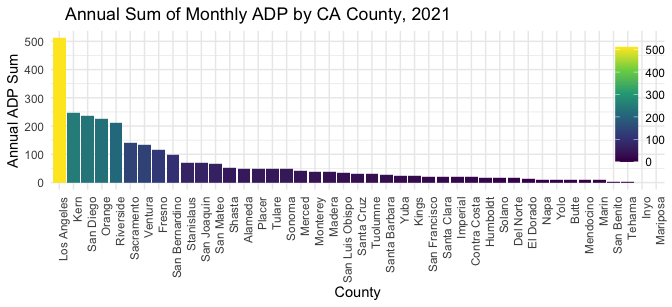
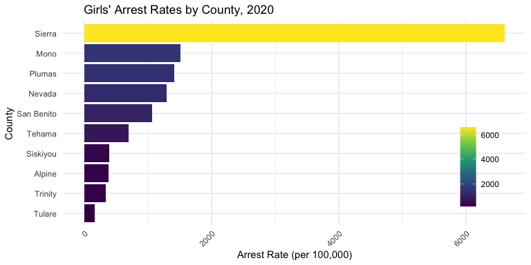
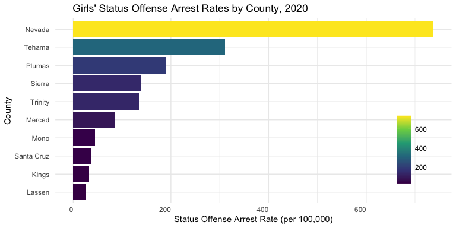

Criminalization of Girls in California: A Fact Sheet
================
Shaina Mackin \| The Vera Institute
March 29, 2022

 

# ACROSS THE STATE

From 2012-2020, **1,122** girls were detained in non-secure facilities
and **32,331** in secure facilities.  
**18.4%** of detentions between 2012-2017 were in secure facilities.

# TOP INCARCERATING COUNTIES

 

## Counties that detained the most girls in 2017:

| County        | Percent of State Total | Number Detained |
|:--------------|:-----------------------|----------------:|
| Los Angeles   | 12.5%                  |             577 |
| San Bernadino | 10.99%                 |             509 |
| Ventura       | 7.12%                  |             330 |
| Orange        | 6.54%                  |             303 |
| Contra Costa  | 5.12%                  |             237 |
| Santa Clara   | 4.62%                  |             214 |
| Santa Barbara | 4.23%                  |             196 |
| Kern          | 3.97%                  |             184 |
| Fresno        | 3.5%                   |             162 |
| Mendocino     | 3.3%                   |             153 |

 

## Counties most likely to detain girls in 2017:

| County          | Percent of Cases | Number of Times in Top 10 |
|:----------------|:-----------------|--------------------------:|
| Glenn           | 100%             |                         6 |
| Modoc           | 100%             |                         4 |
| Mendocino       | 56.7%            |                         5 |
| Sonoma          | 49.2%            |                         2 |
| Imperial        | 48.7%            |                         4 |
| San Francisco   | 48.4%            |                         3 |
| Shasta          | 47.8%            |                         5 |
| Ventura         | 43.5%            |                         2 |
| Santa Clara     | 41.6%            |                         2 |
| San Luis Obispo | 41.1%            |                        NA |

# AVERAGE DAILY POPULATIONS

## Statewide by County

California’s Board of State and Community Corrections (BSCC) reports
Average Daily Populations (ADP) of juvenile facilities by county. In
2021, LA County’s annual sum of monthly ADP counts was over twice that
of Kern’s, the second highest.  

<!-- -->

 

## Zooming in on Santa Clara County

In 2020, Santa Clara County’s highest ADP (n=**21**) occurred in
January, with a steady decline continuing throughout the COVID-19
pandemic. By 2021, even the county’s highest ADP, occurring in February,
had seen an **81%** decrease (n=**4**).

<!-- -->

# ARREST RATES

In 2020, Sierra County had the highest arrest rate of girls per 100,000
population (n=**6610.99**); Sutter County had the lowest (n=**0**). The
top 10 counties with highest girls’ arrest rates in 2020 are displayed
below:   <!-- -->

 

 

## Status Offenses

A status offense is an offense that would not be considered a crime if
committed by an adult. Common status offenses include truancy, running
away, violating curfew, or possessing substances (BSCC). Nevada County
had the highest status offense rate per 100,000 girls in 2020
(n=**738.15**). The top 10 counties with highest girls’ status offense
arrest rates in 2020 are displayed below.

<!-- -->

# DETENTION PROFILES

The California Juvenile Court and Probation Statistical System (JCPSS)
reports data on the proportion of cases within racial groups that result
in types of detention decisions.

 

 

<!-- -->
