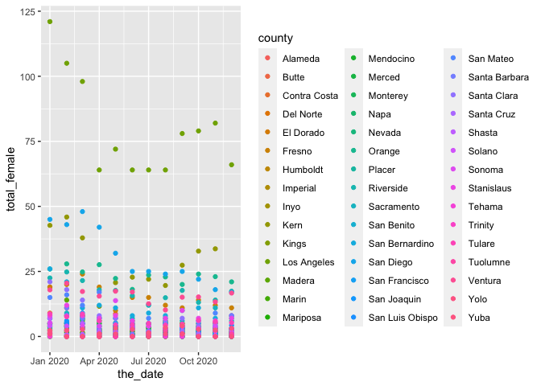

ADP
================
Shaina Mackin
2/20/2022

``` r
adp_df = read_excel("./data/juvenile_adp.xlsx", col_types = "text") 
```

``` r
adp_girls = adp_df %>%
  janitor::clean_names() %>%
  mutate(
    adp_pre_disposition_female = replace(adp_pre_disposition_female, adp_pre_disposition_female == "D", 0),
    adp_pre_disposition_female = replace(adp_pre_disposition_female, adp_pre_disposition_female == "d", 0),
     adp_pre_disposition_female = replace(adp_pre_disposition_female, adp_pre_disposition_female == "u", 0),
     adp_post_disposition_female = replace(adp_post_disposition_female, adp_post_disposition_female == "D", 0),
     adp_post_disposition_female = replace(adp_post_disposition_female, adp_post_disposition_female == "d", 0),
    adp_post_disposition_female = replace(adp_post_disposition_female, adp_post_disposition_female == "u", 0),
  ) %>%
  select(county, year, month, adp_pre_disposition_female, adp_post_disposition_female) %>%
  mutate(
    adp_pre_disposition_female = as.numeric(adp_pre_disposition_female),
    adp_post_disposition_female = as.numeric(adp_post_disposition_female)) %>%
  mutate(
    total_female = adp_pre_disposition_female + adp_post_disposition_female) %>%
    group_by(county, year, month) %>%
  summarise(
    adp_pre_disposition_female = sum(adp_pre_disposition_female),
    adp_post_disposition_female = sum(adp_post_disposition_female),
    total_female = sum(total_female)) %>%
  mutate(
    year = as.numeric(unlist(year)),
    month = as.numeric(unlist(month)),
    day = "01"
    ) %>%
  mutate(
    month = formatC(as.numeric(month), width=2,format='f',digits = 0, flag='0') 
  ) %>%
  select(county, day, month, year, total_female) %>%
  unite('the_date', day:year, remove = FALSE) %>%
  mutate(
    the_date = str_replace(the_date, "_", "\\")
  ) %>%
   mutate(
    the_date = str_replace(the_date, "_", "\\")
  ) %>%
  mutate(
    the_date = lubridate::dmy(the_date)
  )
```

    ## `summarise()` has grouped output by 'county', 'year'. You can override using the `.groups` argument.

``` r
adp_girls %>%
  filter(year == 2020) %>%
  ggplot(aes(x = the_date, y = total_female, color = county)) +
  geom_point()
```

<!-- -->
